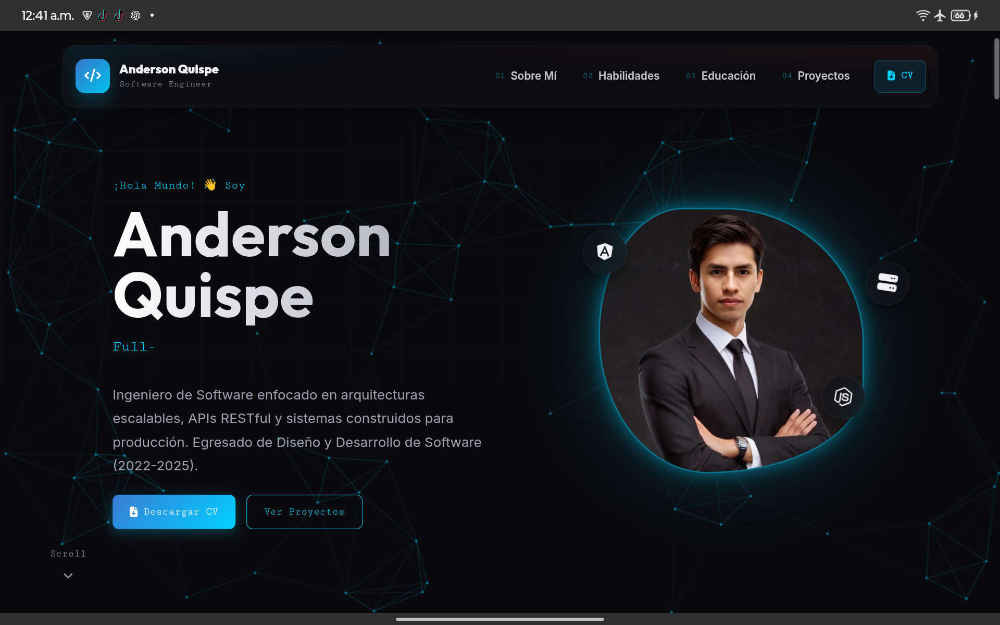

# Anderson Quispe | Portfolio Web

Portafolio personal desarrollado como una experiencia web moderna, responsiva y empaquetable para Android con Capacitor. El proyecto presenta el perfil profesional de Anderson Quispe, sus habilidades, formación, experiencia y proyectos destacados.



<p align="center">
  <a href="https://andiquis.github.io/MySite/www/" target="_blank">
    
  </a>
</p>

## Descripción

Este sitio funciona como carta de presentación profesional para mostrar experiencia en desarrollo de software, backend, frontend, arquitectura de sistemas, despliegues y proyectos aplicados en distintos sectores.

La interfaz está construida con HTML, CSS y JavaScript puro, cuidando detalles visuales como animaciones de entrada, partículas de fondo, navegación glassmorphism, efectos de cursor, títulos con descifrado dinámico y diseño adaptable para celulares.

## Características

- Diseño responsive para escritorio y dispositivos móviles.
- Header tipo glass con menú hamburguesa compacto.
- Hero principal con imagen de perfil, badges flotantes y texto dinámico.
- Secciones de perfil, habilidades, educación, experiencia y proyectos.
- Animaciones de revelado al hacer scroll.
- Efecto descifrador en los títulos de sección.
- Fondo animado con partículas en canvas.
- Descarga directa del CV desde la página.
- Preparado para empaquetarse como app Android mediante Capacitor.

## Tecnologías

- HTML5
- CSS3
- JavaScript
- Font Awesome
- Capacitor
- Android Gradle
- pnpm

## Estructura

```text
MySite/
├── assets/
│   ├── captura.png
│   ├── icon.png
│   └── splash.png
├── android/
│   └── app/
├── www/
│   ├── assets/
│   ├── index.html
│   ├── script.js
│   └── styles.css
├── apk_ouput.sh
├── capacitor.config.json
├── package.json
└── README.md
```

## Uso Local

El proyecto es estático, por lo que puede abrirse directamente desde:

```text
www/index.html
```

También puedes servirlo con cualquier servidor local si prefieres probarlo en navegador con rutas más reales.

## Instalación

Instala las dependencias del proyecto:

```bash
pnpm install
```

## Capacitor

La configuración principal se encuentra en:

```json
{
  "appId": "www.xQore.com",
  "appName": "MySite",
  "webDir": "www"
}
```

Para sincronizar los archivos web con Android:

```bash
npx cap sync android
```

## Generar APK

El proyecto incluye un script para sincronizar Capacitor, compilar el APK e instalarlo en un dispositivo Android conectado:

```bash
./apk_ouput.sh
```

El APK debug se genera en:

```text
android/app/build/outputs/apk/debug/app-debug.apk
```

## Requisitos Para Android

- Android SDK configurado.
- Java JDK o JBR de Android Studio.
- `adb` disponible en el `PATH`.
- Dispositivo Android con depuración USB habilitada.

## Autor

Desarrollado por **Anderson Quispe**.

- GitHub: [Andiquis](https://github.com/Andiquis)
- LinkedIn: [Anderson Quispe](https://linkedin.com/in/anderson-quispe-bb9a68298)
- WhatsApp: [Contacto directo](https://wa.me/51942287756)
